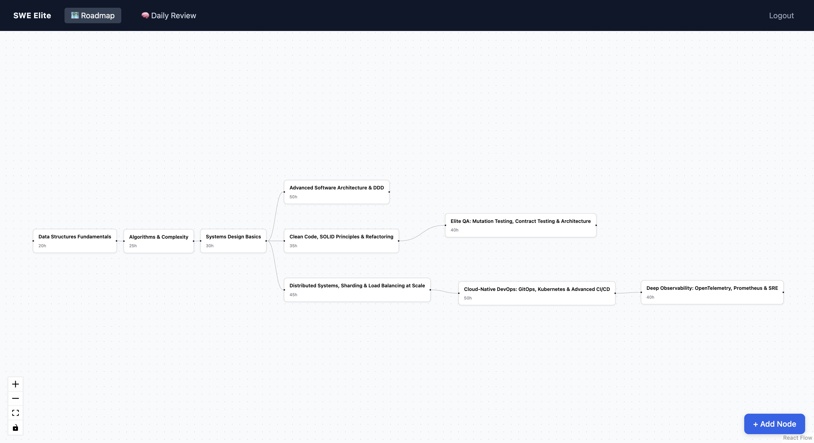
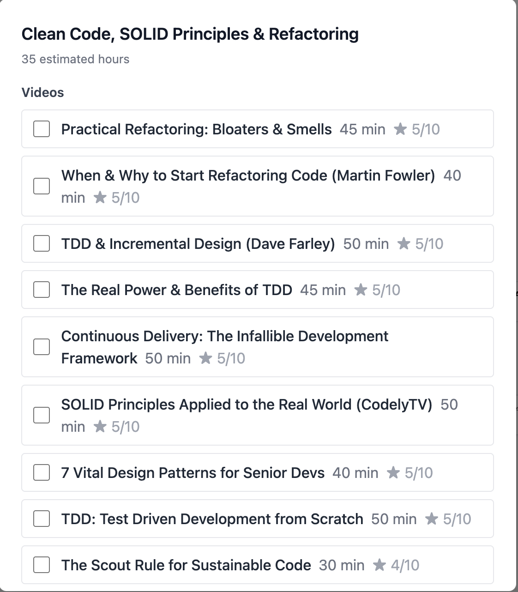
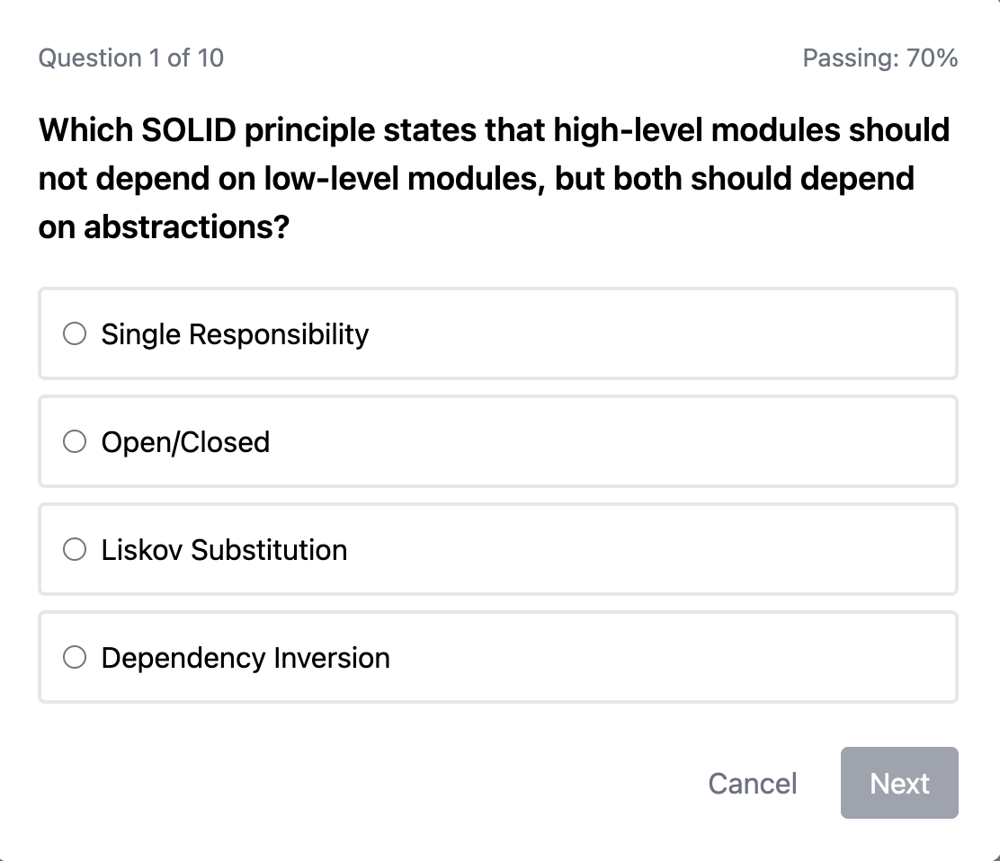
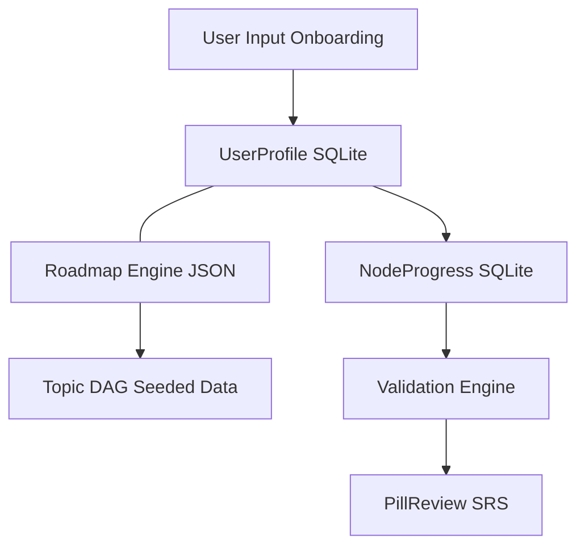

<div align="center">
  <h1>🚀 Top 1% SWE Elite Platform</h1>
  <p><strong>Self-hosted learning platform for software engineers aspiring to reach the top 1% of the industry.</strong></p>
  <p>Provides a guided, adaptive roadmap from fundamentals to elite-level engineering — driven by solid foundations and real projects, not shortcuts.</p>

  
  
  
  
</div>

<br />

## ✨ What It Does

- 🗺️ **Adaptive Roadmap** — Interactive DAG (React Flow) that unlocks topics based on dependency graph progress and personal deadlines.
- 🎯 **Deep Onboarding** — Honest skill assessment that sets your starting point and calculates remaining days to your goal.
- 💊 **Microlearning Hub** — Spaced repetition pills (3 / 7 / 30 day intervals) for long-term retention.
- ⚔️ **Validation Engine** — Proof-of-work challenges (quizzes, tradeoff analysis) to mark topics as mastered.
- 🏗️ **Capstone Projects** — Iterative real-product projects instead of isolated exercises.

---

## 📸 Platform Sneak Peek

<div align="center">
  
  <br/><br/>
  
  &nbsp;&nbsp;
  
</div>

---

## 🏗️ Architecture



### 🧠 Key Decisions

| Decision | Choice | Rationale |
|---|---|---|
| **Runtime** | No LLM APIs in v1.0 | Self-hosted, zero latency, no privacy leak 🔒 |
| **ORM** | Prisma | Safe migrations, strong type generation for complex schema 🗄️ |
| **Visualization** | React Flow | Interactive DAG for adaptive roadmap 📊 |
| **Database** | SQLite via Prisma | Zero-config, single file, perfect for local-first 📦 |
| **CSS** | Tailwind | Utility-first fits component library approach 🎨 |
| **Testing** | Vitest | Native ESM, fast cold start, Next.js ecosystem aligned 🧪 |

---

## 🛠️ Tech Stack

- **Framework:** Next.js 14 (App Router, Server Components)
- **Database:** SQLite + Prisma
- **Visualization:** `@xyflow/react` (React Flow) + `@dagrejs/dagre` (auto-layout)
- **Styling:** Tailwind CSS
- **Testing:** Vitest
- **Infrastructure:** Docker (single container)

---

## 🚀 Quick Start

Get up and running in minutes!

```bash
# 1. Clone the repository
git clone https://github.com/jlromgaz/swe-elite-platform.git
cd swe-elite-platform

# 2. Run with Docker Compose
docker compose up -d

# 3. Open your browser!
# App available at http://localhost:3000 🎉
```

> **💡 Note:** The container automatically pushes the Prisma schema to SQLite, seeds foundational topics and pills, and starts the Next.js server!

### 💻 Local Development (without Docker)

```bash
npm install

# Setup database
cd packages/db
npx prisma db push
npx prisma generate
npx prisma db seed
cd ../..

# Run dev server
npm run dev
```

---

## 📂 Project Structure

```text
swe-elite-platform/
├── apps/
│   └── web/                    # 🌐 Next.js App Router
│       ├── app/
│       │   ├── (onboarding)/   # 🚀 Onboarding wizard
│       │   ├── (dashboard)/    # 🗺️ Roadmap, pills, validation pages
│       │   └── api/            # 🔌 API routes
│       ├── Dockerfile
│       └── package.json
├── packages/
│   ├── db/                     # 🗄️ Prisma schema, client, seed data
│   │   ├── prisma/
│   │   │   ├── schema.prisma
│   │   │   └── seed.ts
│   │   └── src/
│   └── ui/                     # 🎨 Shared UI components (NodeCard, PillCard, etc.)
├── scripts/
│   └── start.sh                # 🐳 Docker entrypoint (db push → seed → start)
├── docker-compose.yml
└── package.json                # 📦 NPM workspaces root
```

---

## 🔌 API Routes

| Method | Route | Description |
|--------|-------|-------------|
| `GET`  | `/api/health` | Liveness check |
| `POST` | `/api/onboarding` | Create user profile, seed node progress |
| `GET`  | `/api/roadmap` | User's full DAG topics + states |
| `POST` | `/api/roadmap/[topicId]/start` | Transition topic to in_progress |
| `POST` | `/api/roadmap/[topicId]/complete`| Master topic + unlock dependents |
| `GET`  | `/api/pills/due` | Pills due for SRS review today |
| `POST` | `/api/pills/[pillId]/review` | Submit SRS review score |
| `GET`  | `/api/validations/[topicId]` | Get validation challenge |
| `POST` | `/api/validations/[topicId]/submit`| Score validation attempt |

---

## 🧪 Testing

```bash
# Run all tests
npm test

# Run a specific package
cd packages/db && npm test
cd apps/web && npm test
```

---

## 🤝 Content Contribution

Want to add more elite topics or resources? Awesome! Content is seeded via `packages/db/prisma/seed.ts`. 

1. Edit `seed.ts` with your additions.
2. Run `npx prisma db seed`.
3. Submit a PR! 🚀

---

<div align="center">
  <p>Built with ❤️ for engineers aiming for the top 1%.</p>
  <p>License: MIT</p>
</div>